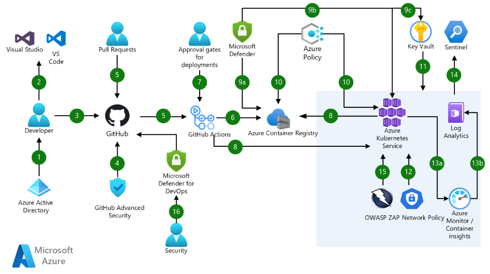
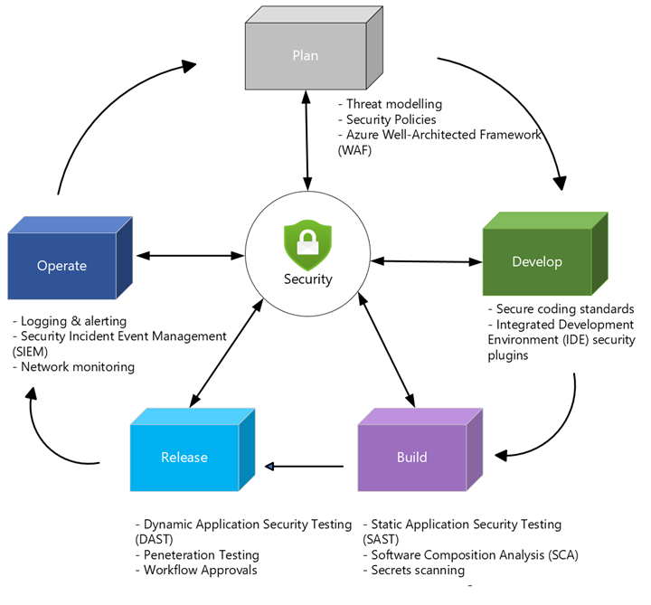

# DevSecOps on Azure Kubernetes Service (AKS)

DevSecOps builds on the practice of DevOps by incorporating security at different stages of a traditional DevOps lifecycle. Some of the benefits of building security in DevOps practices include:

- Make your applications and systems more secure by providing visibility into security threats and preventing vulnerabilities from reaching deployed environments
- Increased security awareness with your Development and Operation teams
- Incorporates automated security processes into your Software Development Lifecycle (SDLC)
- Reduce cost to remediate by finding security issues early in development and design stages

When applying DevSecOps to Azure Kubernetes Service (AKS), there are many considerations for implementing security by different organization roles such as Developers building secure applications running on AKS, Cloud Engineers building secure AKS infrastructure, or various Operations teams that may govern clusters or monitor security issues. This guide has been broken out into different DevOps lifecycle stages with considerations and recommendations for embedding security controls and security best practices. This guide includes common processes and tools to incorporate into CICD pipelines, opting for easy-to-use built-in tools where available.

As a pre-requisite to this article, it is recommended to review the following article, [Build and deploy apps on AKS using DevOps and GitOps](https://learn.microsoft.com/en-us/azure/architecture/example-scenario/apps/devops-with-aks)

## Process flow

Link to Visio -\> [devsecops-azure-aks.vsdx](https://microsoft.sharepoint.com/:u:/t/AzureArchitectureCenter/ESl-N0a8TAhHtKwF0NDB5jcBMs5aVDWCHw2xUyu6t4oMbA?e=mn0CuY)

Note: While this workshop explicitly references AKS, GitHub, the recommendations mentioned would apply to any container orchestration or CICD platform, while the implementation details may vary, most of the concepts and practices mentioned in each stage would still be relevant and applicable.

1. Azure Active Directory (Azure AD) is configured as the identity provider for GitHub. Multi-factor authentication (MFA) should be configured for extra authentication security.
2. Developers use Visual Studio Code or Visual Studio with security extensions enabled to proactively analyze their code for security vulnerabilities.
3. Developers commit application code to a corporate owned and governed GitHub Enterprise repository.
4. GitHub Enterprise integrates automatic security and dependency scanning through [GitHub Advanced Security](https://docs.github.com/en/enterprise-cloud@latest/get-started/learning-about-github/about-github-advanced-security)
5. Pull requests trigger continuous integration (CI) builds and automated testing via GitHub actions.
6. The CI build workflow via GitHub actions generates a Docker container image that is stored to Azure Container Registry.
7. Manual approvals can be introduced for deployments to specific environments like production as part of the Continuous Delivery (CD) workflow in GitHub Actions.
8. GitHub Actions enable Continuous Delivery (CD) to Azure Kubernetes Service. GitHub Advanced security can be used to detect secrets, credentials and other sensitive information in your application source and configuration files.
9. Microsoft Defender is used to scan the ACR registry, AKS cluster & Azure Key Vault for security vulnerabilities.
  1. Microsoft Defender for containers will scan the container image for known security vulnerabilities upon uploading it to Azure Container Registry.
  2. Microsoft Defender for containers can also be used to perform scans of your AKS environment and provides run-time threat protection for your AKS clusters.
  3. Microsoft Defender for Azure Key Vault detects harmful and unusual, suspicious attempts to access key vault accounts.
10. Azure Policies can be applied to Azure Container Registry (ACR) and Azure Kubernetes Service (AKS) for policy compliance and enforcement. Common security policies for ACR and AKS are built-in to allow for quick enablement.
11. Azure Key Vault is used to securely inject secrets and credentials into an application at runtime, abstracting sensitive information away from developers.
12. The AKS network policy engine should be configured to secure traffic between application pods using Kubernetes network policies.
13. Continuous monitoring of the AKS cluster can be set up using Azure Monitor & Azure Container Insights to ingest performance metrics and analyze application & security logs.
  1. Azure Container Insights is used to retrieve performance metrics and application and cluster logs.
  2. Diagnostic and application logs are pulled into an Azure Log Analytics workspace to run log queries.
14. Microsoft Sentinel, which is a SIEM (security information and event management) solution, can be used to ingest and further analyze the AKS cluster logs for any security threats based on defined patterns and rules.
15. Open-Source tools such as OWASP (Open Web Application Security Project) ZAP can be used to do penetration testing for web applications and services.
16. Defender for DevOps, a service available in Defender for Cloud, empowers security teams to manage DevOps security across multi-pipeline environments including GitHub and Azure DevOps.

## Personas Overview and Responsibilities

To manage the complexity of managing DevSecOps on Kubernetes based solution deployments, it is best to look at it in term of a separation of concerns. Which team in an enterprise environment should be concerned with what aspect of the deployment and what tools and processes should that team employ to best achieve their objectives. In this section we will be going over the common roles of developers, application operators (SRE - Site Reliability Engineers), cluster operators, and security teams

### Developers

Developers are responsible for writing the code that comprises the application. They are also responsible for committing their code to the designated code repository. One of the important responsibilities of developers also includes authoring and running scripts for automated testing to ensure their code actually works as intended and integrates seamlessly with the rest of the application. They are usually also responsible for defining and scripting the building of container images as part of the automation pipeline.

### Application operators (site reliability engineers)

Building applications on the cloud using containers and Kubernetes can simplify application development, deployment, and scalability. But these development approaches also create increasingly distributed environments that complicate administration. SRE builds solutions to automate oversight of large software systems. They serve as a bridge between development and Cluster operator teams and help establish and monitor service level objectives and error budgets. This way they help manage application deployments and often write Kubernetes manifest (YAML) files as well as 

### Cluster operators

This team is responsible for configuring and managing the cluster infrastructure. They often use infrastructure as code (IaC) best practices and frameworks like [GitOps](https://learn.microsoft.com/en-us/azure/architecture/example-scenario/gitops-aks/gitops-blueprint-aks) to provision and maintain their clusters. They use various monitoring tools like Azure monitor container insights and Prometheus/Grafana to monitor overall cluster health. They are responsible for patching and cluster upgrades, permissions / RBAC, etc. on the cluster. In DevSecOps teams, they ensure that the clusters meet the security requirements of the team and work with the security team to create those standards.

### Security team

The security team is responsible for developing security standards and enforcing them. In some teams they may be responsible for creating and selecting Azure policy that will be enforced in the subscriptions and resource groups holding the clusters. They monitor security issues and together with the other teams, ensure that security is brought to the forefront of every step of the DevSecOps process.

## DevSecOps lifecycle stages

Security controls are implemented in each phase of the software development life cycle (SDLC), this is a key proponent of a DevSecOps strategy and the shift-left approach.

Link to diagram -\> [DevSecOps-stages - v2.vsdx](https://microsoft.sharepoint.com/:u:/t/AzureArchitectureCenter/EfDmqUmuBBhJiTjx91e-wmUBvFvo4n-R80VEqbYrAtUCrA?e=CKhFel)