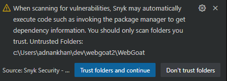
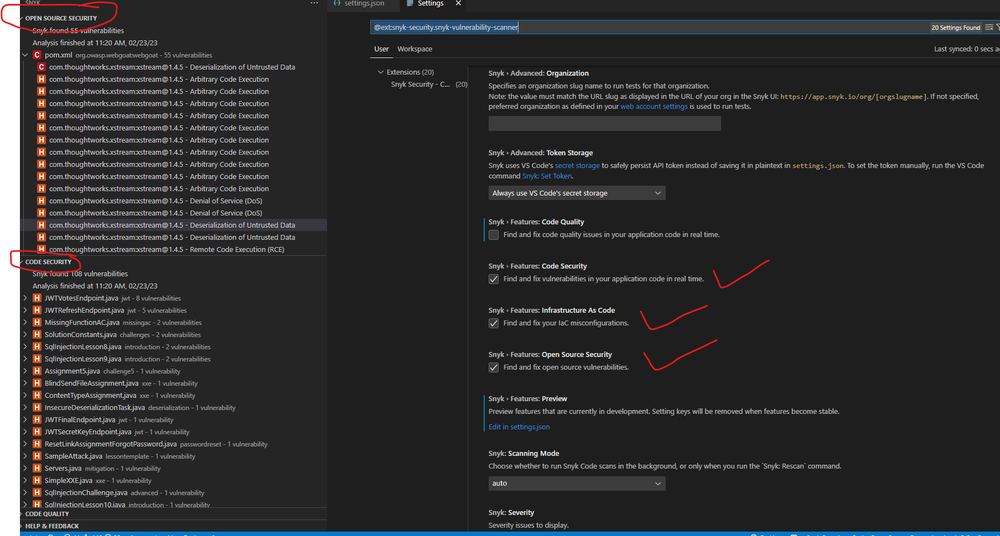

# Module 2: Develop - IDE Plugins for VS Code

In this lab we will be using a popular open source security plugin for VS Code to illustrate how developers can get immediate feedback for any security vulnerabilities within their project. We will be using a sample Java application bundled within our repo that has been intentionally built with security flaws and integrates 3rd party libraries with known vulnerabilities.

## Lab Module 2a - Install and configure VS Code Snyk security extension  
&nbsp;

**Note: The Snyk extension currently does not seem to work well on WSL and hence recommended that you use this with VS Code in a non WSL environment**

Install the VS Code security extension to analyze your application code and dependencies for common security flaws. 

1. Launch VS Code on your local machine and open the src folder within module 2 under the tools/deploy/module2 directory.
2. In the left panel, click on the extensions button (Ctrl+Shift+X) and type "Snyk" in the extensions search bar.
3. Select the "Synk Security - Code, Open Source, IaC config" extension as shown below and click on the install button

   
4. Note: Before the Snyk extension can analyze a project, it must be explicitly enabled to trust the specific project folder as shown in the image below. Simply click on the "Trust folders and continue button" to enable the plugin for your specific project.

    

    You may also get a dialog message to trust workspace and to connect your account to Snyk on the first usage of the extension, this is a one-time setup and can be done by simply clicking on the button shown below. **You do not need to explicitly register on the Snyk site to enable this within VS code.**

    

5. After the extension has been enabled, you can inspect the "Problems" panel within VS Code (Ctrl+Shift+M) to view the problems reported by the Snyk security extension, **note**: it may take a few minutes the first time for Snyk plugin for a project to fully analyze all the source code and libraries within your project.

6. The Problems panel highlights all the details associated with the security vulnerability, the details can be filtered by using the filter dropdown to limit the view by severity level. Snyk also does code quality checks and these also can be disabled in the extension settings if needed to filter out noise. (See below for reference on settings)

   
 7. The Snyk side bar panel allows more detailed views for all security and quality issues found by the extension, this includes the open source dependency vulnerabilities as shown in the diagram below.

    

8. (Optional) Synk extension can be configured as needed to do a variety of code analysis for both security and code quality, these options can be configured via the extension's config panel as shown in the image.

   

### Notes
- The above lab uses a Java application but any language runtime can be used, Snyk supports most popular languages. More details can be found at
[Supported languages/frameworks]( https://docs.snyk.io/scan-application-code/snyk-open-source/snyk-open-source-supported-languages-and-package-managers)

- The OWASP foundation also publishes vulnerable apps for most common programming languages, these are useful for testing for security flaws with tools such as Snyk and other popular SAST tools. [OWASP Vulnerable web apps directory](https://owasp.org/www-project-vulnerable-web-applications-directory/)
  

