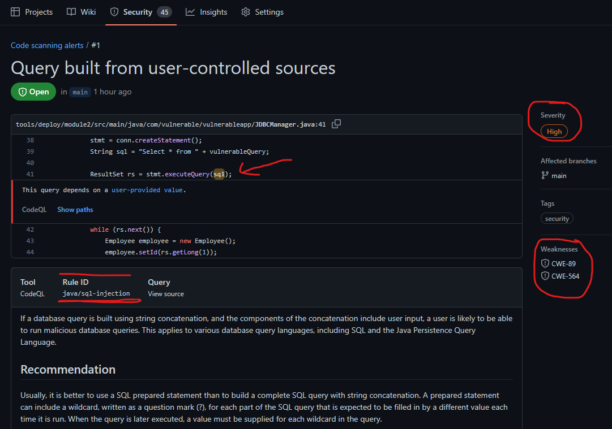

# Module 2: Develop - GitHub Security Code scanning using CodeQL

### Perform Static Code Analysis (SAST) 

Use GitHub Advanced Security scanning capabilities for code scanning and CodeQL. Code scanning is a feature that can be used to analyze the committed code in a GitHub repository to find security vulnerabilities in your application source and also to look for any 3rd party libraries that may be exposed for security issues. The GitHub security/code scanning Any problems identified by the analysis are shown in GitHub repository dashboard along with details on remediation

## Lab Module 2b - Enable GitHub code scannning on your GitHub repository 
&nbsp;

We can use the sample vulnerable app from the earlier lab (2a) for this lab exercise as well, while the Snyk extension in the earlier lab was used for doing client side, pre-commit checks and analysis, GitHub code scanning will be used for server side checks to ensure all code committed to the remote repository is scanned for vulnerabilities.

1. In the GitHub console, enable code scanning within your git repository settings, **note** for forked repositories, its important that you first enable GitHub actions before security code scanning can be enabled as shown below.

   
   
    After GitHub actions is enabled, you can click on the Security menu option and setup code scanning as shown below

   

    Click on the setup CodeQL and select the "advanced" option as shown below

   


2. The previous step will auto generate a starter GitHub action `codeql.yml` file, we will make a small change to the `codeql.yml` to configure scanning for our sample app. Please make the following change as shown in the section below, we will comment out the Autobuild section and introduce a custom build command instead

   ```yaml
      #- name: Autobuild
      #  uses: github/codeql-action/autobuild@v2

       - name: Build Java
         run: |
           mvn clean package -f tools/deploy/module2/pom.xml
   ```
       The completed `codeql.yml` should then look as follows, we will keep all the other default values.

   

3. Commit the `codeql.yml` file to the repository, this should automatically trigger the github code scanning action to analyze your application code.

   
 

4. Following the GitHub action run, you should be able to view details of the security analysis and get details and severity level of each issue with specific instructions on remediation.

   

   Clicking on a specific alert displays the security severity details and remediation steps.

   