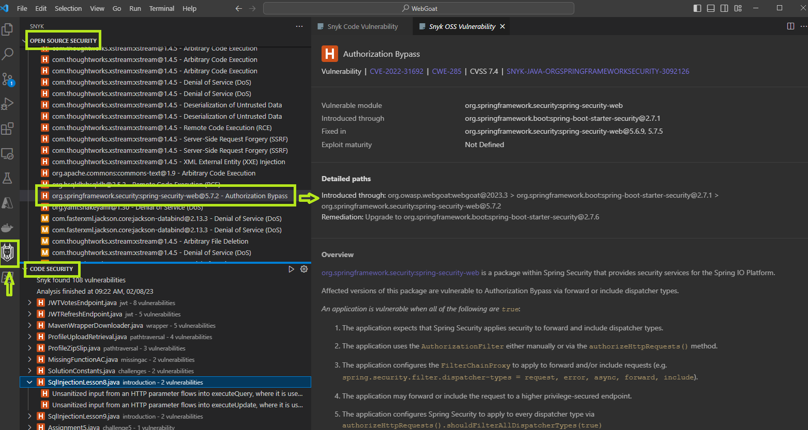

# Module 2: Develop - IDE Plugins for VS Code/Java

## Lab Module 1 - Install VS Code plugin  
&nbsp;

Install the Visual Studio Code plugin to analyze your application code for common security flaws

1. Launch VS Code on your computer
2. In the left panel, click on the extensions button (Ctrl+Shift+X) and type "Snyk" in the externsions search bar
3. Select the Synk Security - Code, Opens SOurce, IaC config extension as shown below and click on the install button

   
4. The Visual Studio extension should now be enabled for all projects referenced

&nbsp;  

### Lab Module 2 - Download the OWASP vulnerable web app source code    
1. Clone the OWASP WebGoat repo from GitHyb public repo https://github.com/WebGoat/WebGoat  The webGoat application is a sampke web app that illustrates many of the common vulenerabilities in web facing applications as determined by the OWASP Top Ten.
2. Go to the folder you have downloaded the project to /webGoat root folder and launch VS Code by typing "code ." from the root project directory
3. Optional - build the project
4. Inspect the "Problems panel within VS Code (Ctrl+Shift+M) to view the problems reported by the Snyk security extension, note: it may take a few minutes the first time for Snyk plugin for a project to fully analyze all the source code in your project.
5. The problems panel shows all the details with the source file and line of code, the details can be fileterd by using the filter dropdown to limit the view from errors vs warnings. 

 
 6. The snyk side bar panel allows more detailed views for open source dependency vulnerabilities as shown in the diagram below, this step is also usually included in a development pipeline as part of Software Composition Analysis (SCA)

