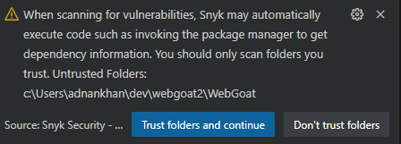

# Module 2: Develop - IDE Plugins for VS Code

In this lab we will be using a popular open source security plugin for VS Code to illustrate how developers can get immediate feedback for any security vulenerabilities within their project. We will be using a sample application published by OWASP organization to demo the capabilities of the extension.

## Lab Module 2a - Install and configure VS Code Snyk security extension  
&nbsp;

Install the VS Code security extension to analyze your application code and dependencies for common security flaws

1. Launch VS Code on your local machine
2. In the left panel, click on the extensions button (Ctrl+Shift+X) and type "Snyk" in the extensions search bar
3. Select the Synk Security - Code, Open Source, IaC config extension as shown below and click on the install button


   
4. The Visual Studio extension should now be enabled for all projects referenced, note you may have to restart VS Code for the plugin to be enabled.

&nbsp;  

## Configure VS Code project for security analysis
 Download the sample OWASP vulnerable web application and anylze using the Snyk security extension 

1. Clone the OWASP WebGoat repo from GitHub public repo (https://github.com/WebGoat/WebGoat)  The webGoat application is a sample web application that highlights many of the common flaws found in web facing applications as determined by the OWASP Top Ten list.
   ``` 
    git clone https://github.com/WebGoat/WebGoat.git 
   ```
2. Go to the folder where you have downloaded the project and launch VS Code by from the project directory
   ```
      - cd WebGoat
      - code .
   ```
   Note: Before the Snyk extension can analyze your project, it must be enabled to trust the specific project folder as shown in the image below. Click on the "Trust folders and continue button" to enable the plugin for your project.

    


3. Inspect the "Problems panel within VS Code (Ctrl+Shift+M) to view the problems reported by the Snyk security extension, note: it may take a few minutes the first time for Snyk plugin for a project to fully analyze all the source code in your project.
4. The problems panel shows all the details along with the source file and line of code where the issue was found, the details can be filtered by using the filter dropdown to limit the view by severity level. 

   
 5. The snyk side bar panel allows more detailed views for all security and quality issues found by the extension, this includes the open source dependency vulnerabilities as shown in the diagram below.

    

6. (Optional) Synk extension can be configured as needed to do a variety of code analysis for both security and code quality, these options can be configured via the extension's config panel as shown in the image.

   


### Notes
- The above lab uses a Java web application but any language runtime can be used, Snyk supports most popular languages and runtimes, More details can be found at
[Supported languages/frameworks]( https://docs.snyk.io/scan-application-code/snyk-open-source/snyk-open-source-supported-languages-and-package-managers)
- Other language runtimes and sample applications can also be used for this lab
  1. [Microsoft - RockPaperScissorsLizardSpock](https://github.com/microsoft/RockPaperScissorsLizardSpock)
  2. [OWASP Vulnerable web apps directory](https://owasp.org/www-project-vulnerable-web-applications-directory/)
  

