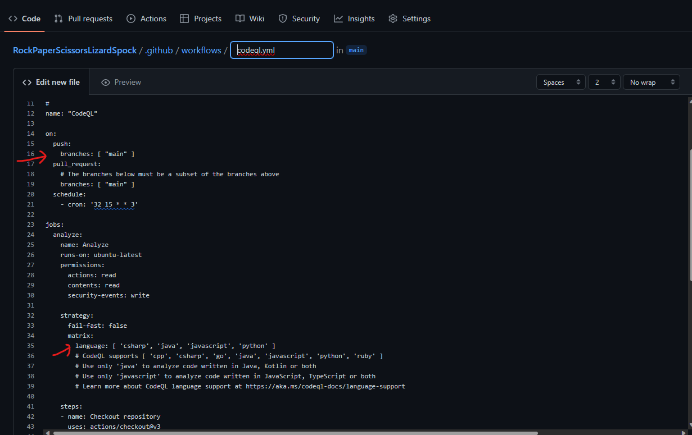
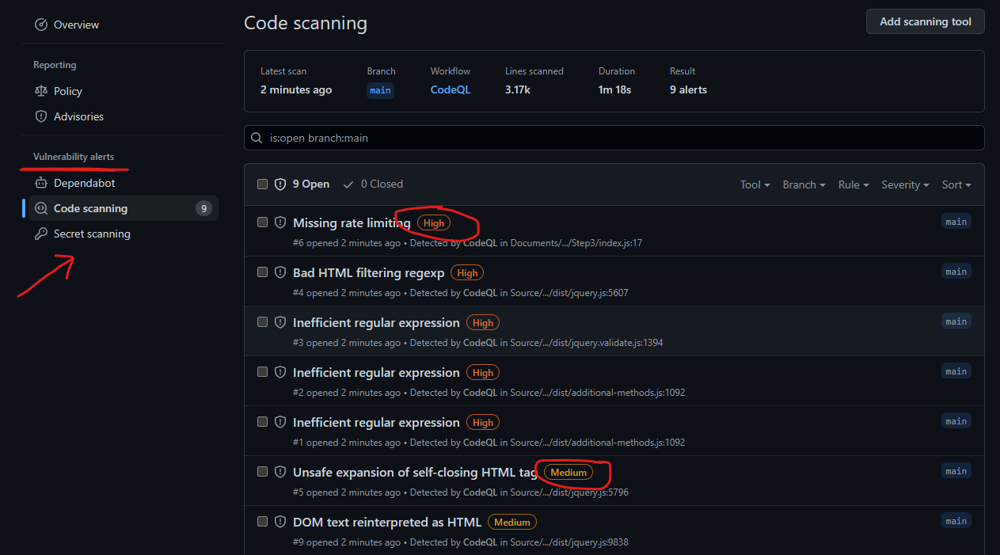
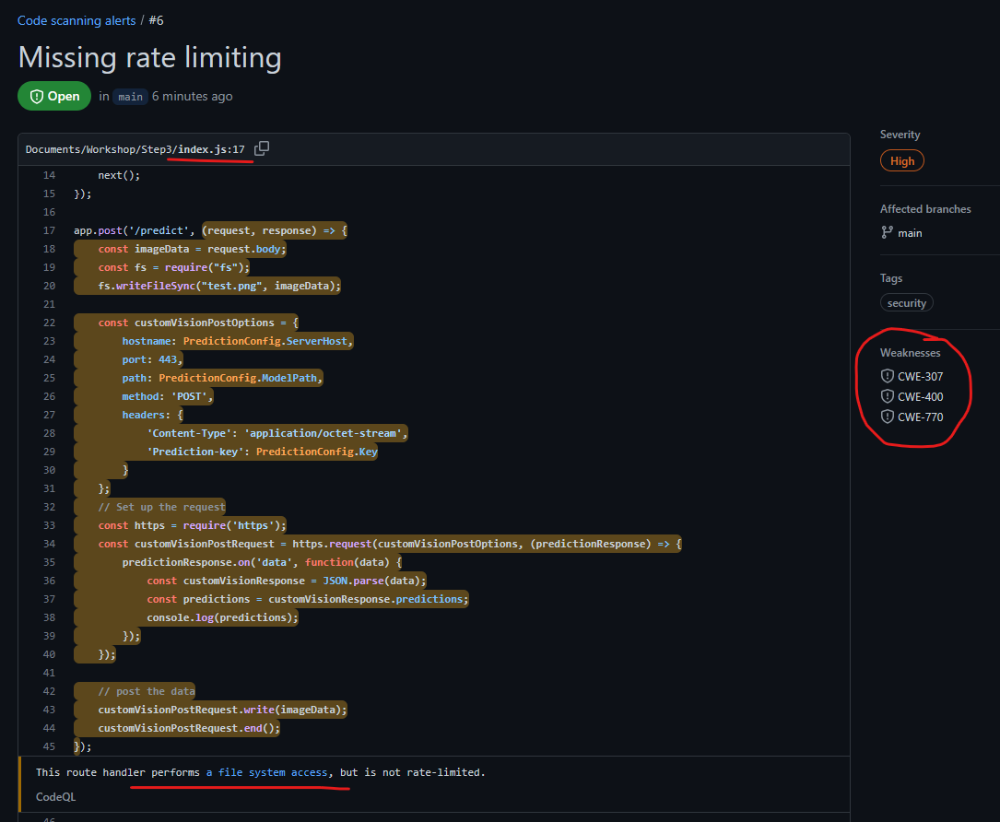

# Module 2: Develop - Security Code scanning using GitHub CodeQL

### Best practice – Perform Static Code Analysis (SAST) to find potential vulnerabilities in your application source code

Use GitHub Advanced Security scanning capabilities for code scanning and CodeQL. Code scanning is a feature that you use to analyze the code in a GitHub repository to find security vulnerabilities and coding errors. Any problems identified by the analysis are shown in GitHub repository dashboard along with details on remidiation

### Enable GitHub code scannning on your GitHub repository

0. Pre-requisite - A sample app that illustrates multiple programming languages runtimes can be used for this lab, it is found here - https://github.com/microsoft/RockPaperScissorsLizardSpock  Simply fork the repo for this lab or use an existing repo.

1. Enable secrets and code scanning within your git repo's settings
   
   

   

2. Commit the codeql.yml config in your repository, this should create a GitHub action to run security scans on your project, you have the option to select branch and schedule as needed, we will use defaults for this exercise

     

3. Run the github action to view the results of your code scan, this should automatically be triggered on the initial commit.

   
 

4. Following the Gigthub action run, you should be able to view details and severity of each issue found with instructions on remodiation.

   

   Clicking on a specific alert displays the security severity details and remediation steps.

   