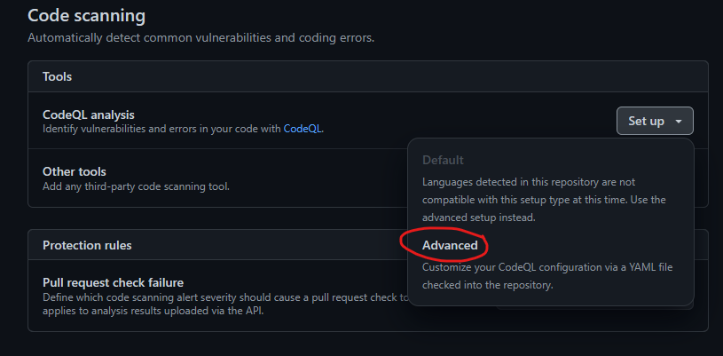

# Module 2: Develop - GitHub Security Code scanning using CodeQL

### Perform Static Code Analysis (SAST) & secrets scanning

Use GitHub Advanced Security scanning capabilities for code scanning and CodeQL. Code scanning is a feature that you use to analyze the code in a GitHub repository to find security vulnerabilities and coding errors. Any problems identified by the analysis are shown in GitHub repository dashboard along with details on remidiation

## Lab Module 2c - Enable GitHub code scannning on your GitHub repository 
&nbsp;

0. Prerequisite - A sample app that illustrates multiple programming languages runtimes can be used for this lab, it can be found here - https://github.com/microsoft/RockPaperScissorsLizardSpock  Simply fork the repo for this lab or use an existing repo.

1. Enable secrets and code scanning within your git repository settings
   
   

   

2. Commit the codeql.yml config in your repository, this should create a GitHub action to run security scans on your project, you have the option to select branch and schedule as needed, we will use defaults for this lab exercise

     

3. Run the github action to view the results of your code scan, this action should automatically be triggered on the initial commit.

   
 

4. Following the GitHub action run, you should be able to view details and severity of each issue with instructions on remediation.

   

   Clicking on a specific alert displays the security severity details and remediation steps.

   