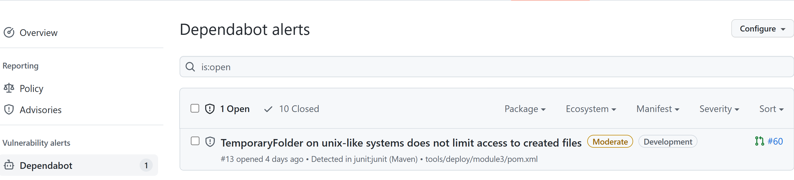
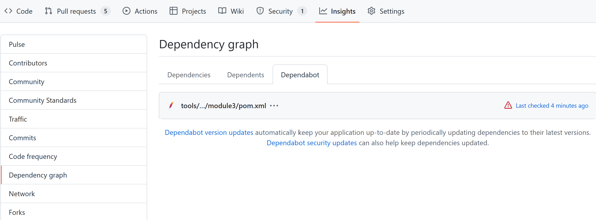
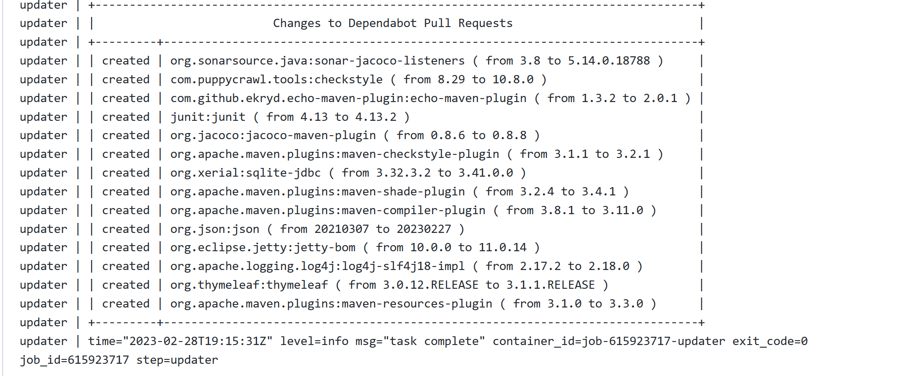
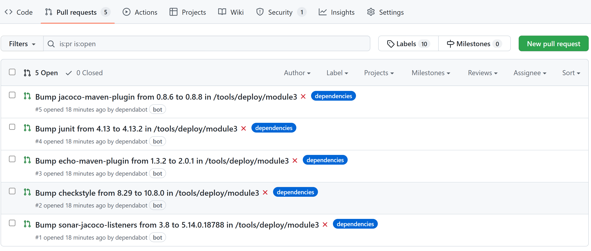
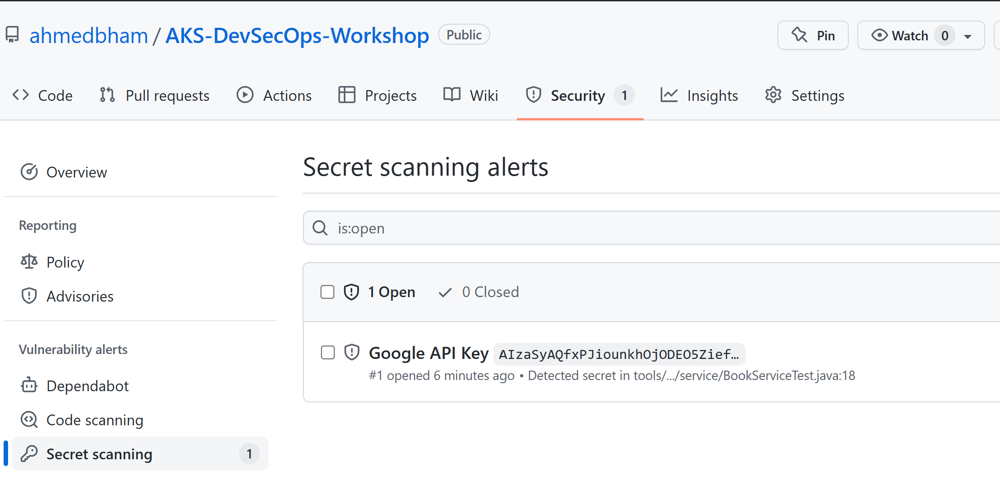
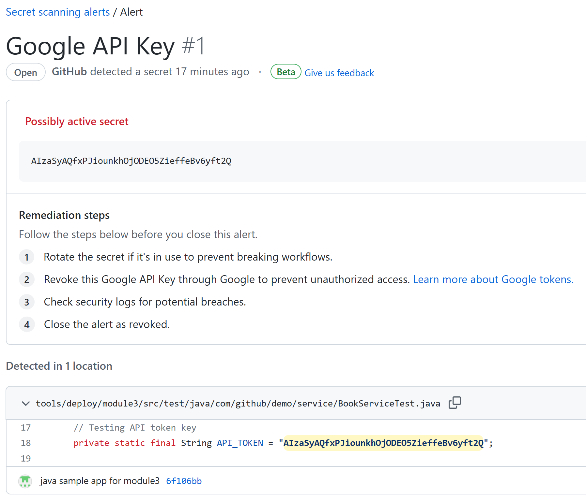

# Build Phase - Lab Instructions

## Lab 1 - Github DependaBot

### Enable Dependabot security and version updates for your repository

* Enable Dependabot alerts for your repository
  * Navigate to the **Settings** tab of your repository
  * Select **Codes security & analysis** from the left-hand menu
  * Click **Enable** next to **Dependabot alerts**
* Enable Dependabot security updates for your repository
  * Click **Enable** next to **Dependabot security updates**
* Enable Dependabot version updates for your repository
  * Click **Enable** next to **Dependabot version updates** to open a basic `dependabot.yml` configuration file in the `.github` directory of your repository
  * set `- package-ecosystem` to `"maven"` and `directory` to `"/tools/deploy/module3"` in the `dependabot.yml` file

  ```yaml
  - package-ecosystem: "maven" # See documentation for possible values
    directory: "/tools/deploy/module3" # Location of package manifests
  ```

  * Click **Commit changes** to commit the file to the `main` branch

### Viewing Dependabot alerts and security updates

* Navigate to the **Security** tab of your repository
* Click **Dependabot alerts** to view the alerts

* Click on the alert to view the details of the alert, including initiating a pull request for **security version update** 
* After you enable version updates, the **Dependabot** tab in the **dependency graph** under **Insights** for the repository is populated (it may take few minutes to complete). 

* Click on **Last Checked 4 minutes ago** to see details.
* Scroll down to see summary of the **Security updates Pull Requests** details.

* Navigate to the **Pull requests** tab of your repository to view the pull request initiated by Dependabot


## Lab 2 - Github Secret Scanning

### Enable Secret Scanning for your repository

* Navigate to the **Settings** tab of your repository
* Select **Codes security & analysis** from the left-hand menu
* Click **Enable** next to **Secret scanning**

### Viewing Secret Scanning results

* Navigate to the **Security** tab of your repository
* Click **Secret scanning** to view the result one file with a Google Key

* Click on the file name to view the details of the alert, including the remediation steps.
