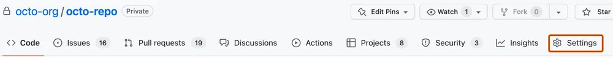
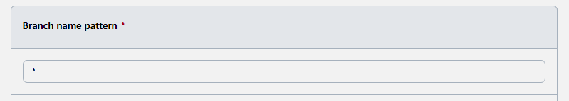
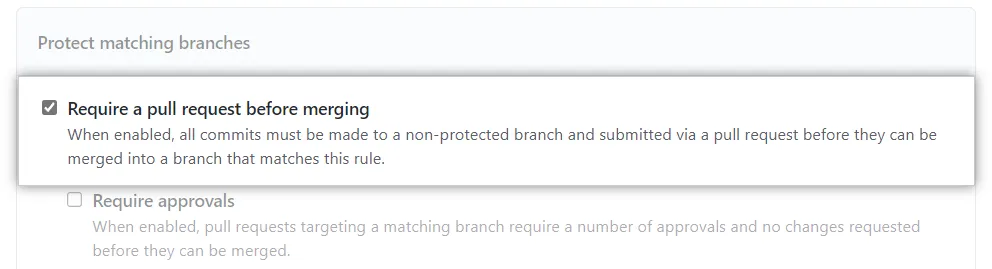

# Module 4: Deploy - Lab
AKS (Azure Kubernetes Service) DevSecOps Deployment refers to the process of deploying containerized applications on AKS while ensuring security and collaboration between development, security, and operations teams.

The operations team deploys the application to AKS, ensuring that security policies and procedures are applied throughout the deployment process.

By following the AKS DevSecOps Deployment process, organizations can ensure that their containerized applications are secure and reliable, and that the development, security, and operations teams are working together effectively to deliver high-quality software.

In this module you will learn a set of foundational methods to secure your app and/or solution to AKS. We invite you to run 2 or all of the labs in the sections below to get familiar with the tools and concepts involved in this process.  

## Managing a branch protection rule
In GitHub, you can create a [branch protection rule](https://docs.github.com/en/repositories/configuring-branches-and-merges-in-your-repository/defining-the-mergeability-of-pull-requests/managing-a-branch-protection-rule) to enforce certain workflows for one or more branches, such as requiring an approving review or passing status checks for all pull requests merged into the protected branch.

> There is a large number of rules you can set up in the Branch settings. In this exercise, we are going to focus on a limited set due to timelines and intentional simplicity of the lab but we encourage you to explore all the options present in the settings.  

### Lab 1 - Creating a branch protection rule
1. On GitHub.com, navigate to the main page of your repository.
2. Under your repository name, click Settings. If you cannot see the "Settings" tab, select the  dropdown menu, then click Settings.  

3. In the "Code and automation" section of the sidebar, click "Branches".
4. Next to "Branch protection rules", click Add rule.
5. Under "Branch name pattern", you can type the branch name or pattern you want to protect. For this lab, we will type "*" (pattern for <i>any</i> branch) in the textbox in order to apply this set of rules to any branch in your repository. 
 
6. Under "Protect matching branches", select Require a pull request before merging. 

