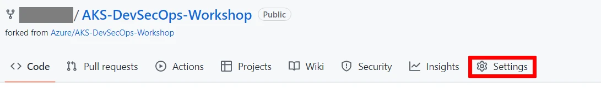
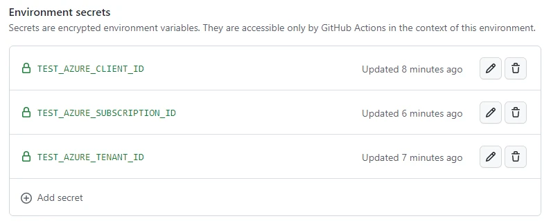
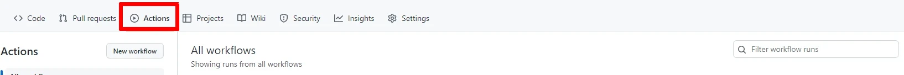
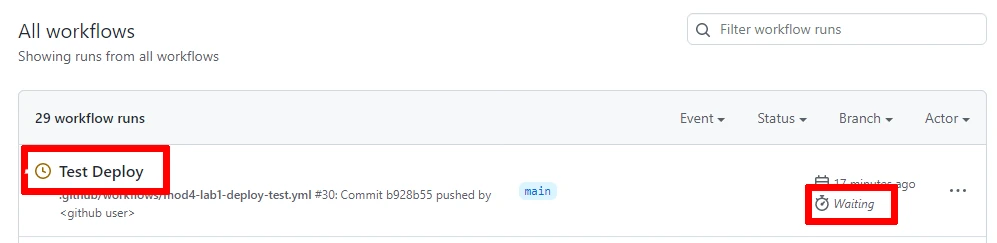
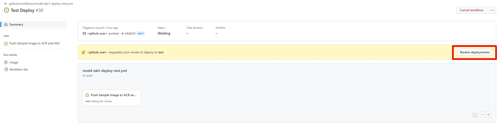
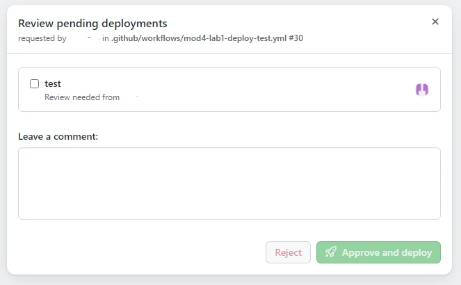
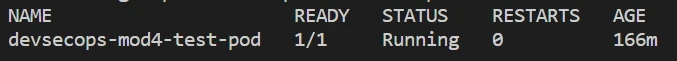

# Module 4: Deploy - Lab
AKS (Azure Kubernetes Service) DevSecOps Deployment refers to the process of deploying containerized applications on AKS while ensuring security and collaboration between development, security, and operations teams.

The operations team deploys the application to AKS, ensuring that security policies and procedures are applied throughout the deployment process.

By following the AKS DevSecOps Deployment process, organizations can ensure that their containerized applications are secure and reliable, and that the development, security, and operations teams are working together effectively to deliver high-quality software.

In this module you will learn a set of foundational methods to secure your app and/or solution to AKS. We invite you to run labs in the sections below to get familiar with the tools and concepts involved in this process.  

## Environments
Environments are used to describe a general deployment target like production, staging, or development. When a GitHub Actions workflow deploys to an environment, the environment is displayed on the main page of the repository. 
You can configure environments with protection rules and secrets. When a workflow job references an environment, the job won't start until all of the environment's protection rules pass. A job also cannot access secrets that are defined in an environment until all the environment protection rules pass.
### **Lab 1 - Creating enviroments, rules and secrets**

1. On GitHub.com, navigate to the main page of your forked repository.
2. Under your repository name, click  Settings. If you cannot see the "Settings" tab, select the "[...]"  dropdown menu, then click Settings.

3. In the left sidebar, click Environments.
4. Click New environment.
5. Enter a name for the environment (e.g.: "test"), then click Configure environment. Environment names are not case sensitive. An environment name may not exceed 255 characters and must be unique within the repository.
6. Specify your github handle/username in the list of "Required reviewers". This will set you as user that must review and approve workflow jobs that use this environment.
7. Click Save protection rules.
8. Add 3 enviroment secrets by following the next steps:
    1. Under Environment secrets, click "Add secret".
        - Enter "TEST_AZURE_CLIENT_ID" (only text - no quotes)
        - Enter the value of <i>$appId</i> retrieved from Module 0.
        - Click Add secret.
        > Note: <br>
        >> if you don't have this value saved or still present in your shell session, you can retrieve the appid specific of this lab by looking at your App Registrations in the Azure Portal (Azure Active Directory section) or by executing the az ad app list command below which will retrieve a list of all your registered applications (list of displayName + appId).<br><br>
        >> Please identify in the output the app registration related to this lab (the one created in Module 0) by recognizing its displayName or its createdDateTime displayed in the output of the previous command. The appId is the guid with a format similar to this: 00000000-0000-0000-0000-000000000000<br>
`
az ad app list --show-mine --query "[].{displayName:displayName appId:appId createdDateTime:createdDateTime}" -o tsv 
`
    2. Under Environment secrets, click "Add secret" again.
        - Enter "TEST_AZURE_TENANT_ID" (only text - no quotes)
        - Enter the value of your tenant id.
        - Click Add secret.
    3. Under Environment secrets, click "Add secret" again.
        - Enter "TEST_AZURE_SUBSCRIPTION_ID" (only text - no quotes)
        - Enter the value of your subscription id.
        - Click Add secret.
> The result should be similar to this:<br>
        

9. Add 4 environment variables to store the values needed by the workflow to execute its deployment to the test enviroment:
    - Under Environment variables, click Add variable.
        - Enter "TEST_AZURE_CONTAINER_REGISTRY" (only text - no quotes)
        - Enter the name of the Azure Container Registry deployed in your resource group(e.g.: devsecopsacr1)        
        - Click Add variable. 
    - Repeat the previous steps to add the following enviroment variables:<br>
        <table> 
        <tr><th>YOUR_VARIABLE_NAME </th><th> Variable value </th></tr>
        <tr><td>TEST_RESOURCE_GROUP</td><td> name of your resource group </td></tr>
        <tr><td>TEST_CLUSTER_NAME </td><td> name of your aks cluster </td></tr>
        <tr><td>TEST_DEPLOYMENT_MANIFEST_PATH </td><td> path to the app manifest. <br><i>Unless different in your fork, the static value to copy as value in this lab is: "tools/deploy/module4/deployment-manifest-test-sample.yaml" (only text - no quotes) </i>  </td></tr>
        </table>
        
    > You can retrieve your TEST_AZURE_CONTAINER_REGISTRY and TEST_CLUSTER_NAME from the portal or by running:
    ```bash
    az acr list -g <your-resource-group> --query [].name -o tsv
    az aks list -g <your-resource-group> --query [].name -o tsv
    ```

10. In [mod4-credential.json](../../../tools/deploy/module4/mod4-credential.json) file, replace `<your-github-username>` with your GitHub username (in your local repo).<br>
    `"subject": "repo:<your-github-username>/AKS-DevSecOps-Workshop:environment:test"`,   
    > If you have named your new repository something other than `AKS-DevSecOps-Workshop`, you will need to replace `AKS-DevSecOps-Workshop` above with the name of your repository. 
    > Also, if your deployment branch is not `main`, you will need to replace `main` with the name of your deployment branch.
11. Setup additional federated identity credential specifically for the test enviroment. 
    1. To setup additional federated credentials identity you will need the $appId created in module 0. <br>If not saved in your session, you can retrieve the appId by looking at your App Registrations in the Azure Portal (Azure Active Directory section) or by using the AZ CLI. <br>The following command will retrieve a list of all <b>your</b> registered applications (list of displayName + appId):
        ```bash 
        az ad app list --show-mine --query "[].{displayName:displayName appId:appId createdDateTime:createdDateTime}" -o tsv
        ``` 
        > The output should contain one or more apps/rows, similar to this:
        ```
        VmPX6gChqC  00000000-0000-0000-0000-000000000000   2023-02-28T16:00:33Z
        ```
        > Note: in the sample above the appId is 00000000-0000-0000-0000-000000000000 but your appId will definitely have a different random value.
    2. Identify in the output the app registration related to Module 0 by recognizing its displayName or its createdDateTime. <br> 
    3. Use the appId (guid only) from the previous command to set the value of appId: 
        ```
        appId=<replace with appId from previous command>
        ```
    4. Now, in the same bash session, run the following command:
        ```bash
        az ad app federated-credential create --id $appId --parameters tools/deploy/module4/mod4-credential.json
        ```
12. Copy [mod4-lab1-deploy-test.yml](../../../tools/tools/deploy/module4/mod4-lab1-deploy-test.yml) to [.github/workflows](../../../.github/workflows/) folder.
13. Modify [text.txt](../../../tools/deploy/module4/text.txt) file and commit & push all changes to trigger the Actions workflow.
    > The workflow is pre-configured to be triggered when any change is pushed to that specific pattern. 
14. Please monitor the execution of the workflow by navigating to "Actions":

15. Click on the workflow currently executing:<br><br><br><br>
    > Note:
    > 1. The label of the workflow run depends on the Commit message you provided when pushing the changes. 
    > 2. You may notice the status Waiting. This depends on the Environment rule we set in step 6. In fact, you will have to review and approve the workflow execution to allow the workflow to run and have permissions to the environment secrets and variables vital to the execution of the workflow. 
    > 3. If he trigger doesn't start the workflow, you can run the workflow manually by selecting the workflow and click on "Run workflow".
16. Once you click on the executing workflow, you should see your running instance waiting for your Review:

17. Click on "Review deployments", confirm the checkbox in the popup and "Approve and deploy":

18. Once the workflow is completed, you can verify the deployment of the pod by executing the following command from the shell:
```bash
kubectl get pod devsecops-mod4-test-pod 
```
The output should be similar to:

